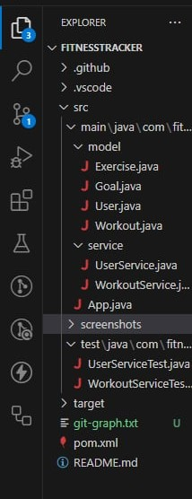
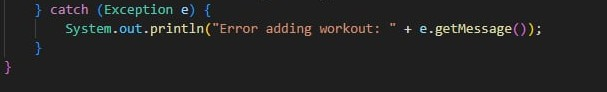
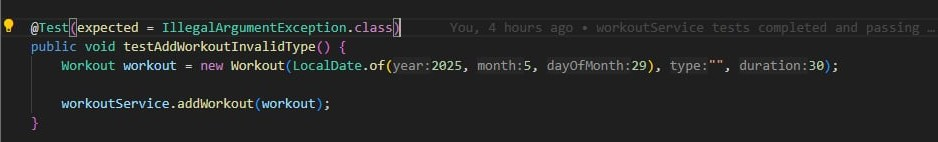
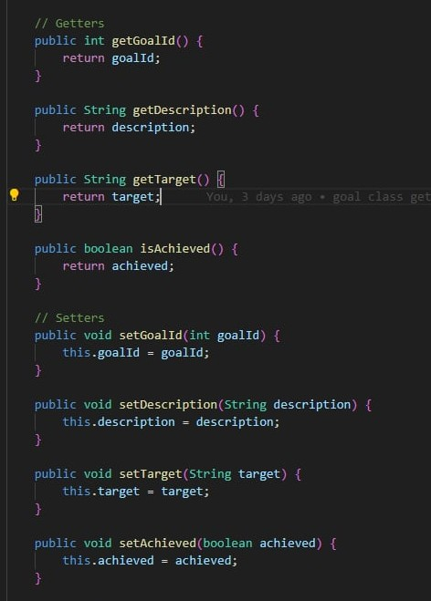

<h1 align="center">Fitness Tracker</h1>
<h2 align="center">QAP 1 - Term 4</h2>
<h3 align="center">Noah Whiffen - SD12</h3>

---

I added a txt file with a git-graph to show my branching and PRs. I wasn't sure if you guys could see it on Github since most of
the branches I worked on were deleted when I no longer needed them. 

The questions were answered by me, then ChatGPT was used to clean up
my Markdown. Cheer!

### 1. How My Code Meets Clean Code Practices  
Here are three examples from my code that demonstrate clean coding principles, supported by screenshots:  

**Meaningful Names:**  
- Class names like `User`, `Workout`, `Exercise`, and `Goal` clearly represent their purposes.  
- Methods such as `addWorkout()`, `deleteWorkout()`, and `findUserByUsername()` clearly indicate their actions.  
- Variables like `workoutService`, `userService`, and `exercises` convey their purposes without ambiguity.  

<!-- Screenshot: Meaningful Names Example -->  
 

**Error Handling and Input Validation:**  
- In `WorkoutService.addWorkout()`, an `IllegalArgumentException` is thrown if the workout type is empty or null.  
- In `App.addWorkout()`, exceptions during user input parsing are caught, and clear error messages are provided.

<!-- Screenshots: Error Handling Example -->  

    

**Encapsulation:**  
- Data models like `User`, `Workout`, `Exercise`, and `Goal` keep fields private and expose access through getter and setter methods.  
- This protects the internal state of objects and enforces controlled access.

<!-- Screenshot: Encapsulation Example -->  
  

There are other examples, but I’m keeping this brief!  

---

### 2. Project Explanation

This project is a simple fitness tracking application that allows users to:  
- Create user profiles  
- Add workouts with exercises  
- Set and track personal goals  
- View and manage workouts and goals  

**How it works:**  
- Data models (`User`, `Workout`, `Exercise`, `Goal`) hold the relevant data.  
- Service classes manage the business logic and data storage in-memory.  
- The `App` class handles user prompts and menu navigation, allowing manipulation of the stored data.  

**Test cases:**  
- Tests verify user management (adding, searching users) and workout management logic to ensure correctness.  

---

### 3. Dependencies and Their Sources  

This project mainly uses libraries that are a part of the standard JDK, such as java.util and java.time. It uses JUnit 4 for testing, which is added by the build tool
(in this case Maven.) Maven is downloaded from the Maven website and helps manage builds and dependencies. 

---

### 4. Challenges Faced During the QAP  

The main issue I ran in to was successfully getting my build checks to pass. At one point I forgot to merge my branches to main and had two branches open at once with
different instances of my code. This caused merge conflicts due to both branches having different versions of certain files. I also was initially intending to append the
created objects to a database, but I realized this was beyond the scope of the project. All the database related files were added from a previous project I worked on with my team.

---
